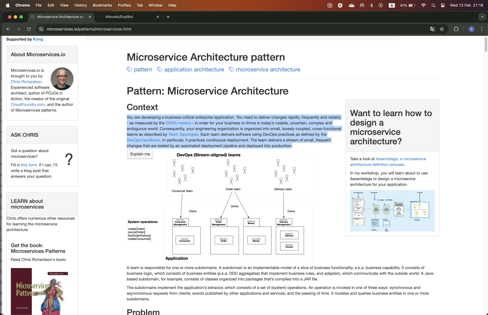
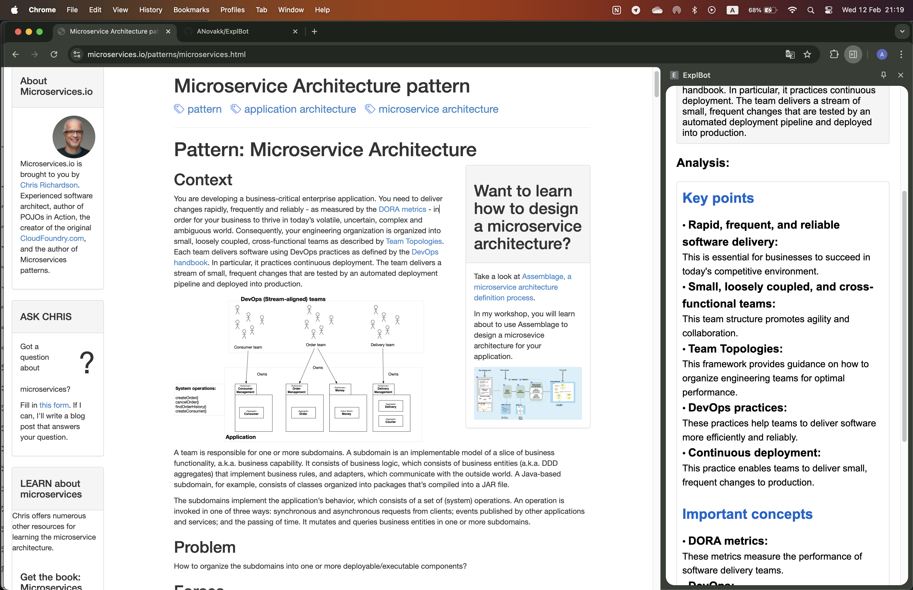

# ExplBot - Text Analysis Chrome Extension

ExplBot is a Chrome extension that helps users analyze and understand text content from any webpage. With just a few clicks, it provides structured analysis including key points, important concepts, and relevant references.

## Features

- **Easy Text Selection**: Select any text on a webpage and click the ExplBot button that appears
- **Smart Analysis**: Get instant analysis of the selected text using Google's Gemini AI
- **Structured Output**: 
  - Key points with detailed explanations
  - Important concepts explained
  - Relevant sources and references

## How to Use

1. Select any text on a webpage
2. Click the ExplBot button that appears near your selection
3. View the analysis in the side panel that opens
4. Select new text and click the button again for more analysis

## Installation

1. Clone this repository
2. Open Chrome and go to `chrome://extensions/`
3. Enable "Developer mode"
4. Click "Load unpacked" and select the extension directory
5. You should get your own API key from Google Cloud Platform and replace it in the `background.js` file